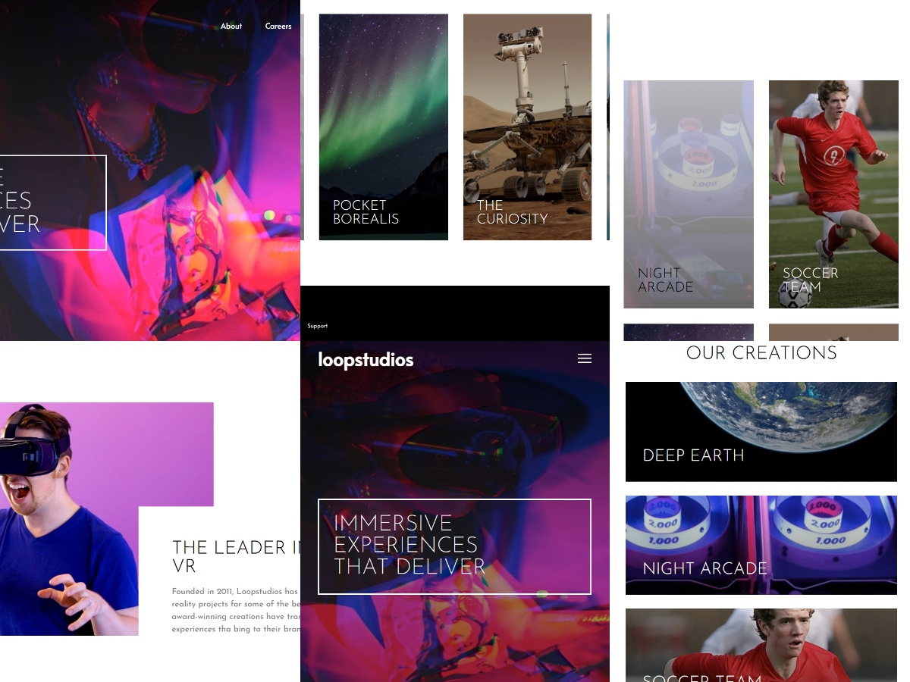

# Frontend Mentor - Loopstudios landing page solution

This is a solution to the [Loopstudios landing page challenge on Frontend Mentor](https://www.frontendmentent.io/challenges/loopstudios-landing-page-N88J5Onjw). Frontend Mentor challenges help you improve your coding skills by building realistic projects. 

## Table of contents

- [Overview](#overview)
- [My process](#my-process)
  - [Built with](#built-with)
  - [What I learned](#what-i-learned)
  - [Continued development](#continued-development)
  - [Useful resources](#useful-resources)
- [Author](#author)

## Overview

### The challenge

Users should be able to:

- View the optimal layout for the site depending on their device's screen size
- See hover states for all interactive elements on the page and amazing animation using GSAP

### Screenshot

### Links

- Solution URL: [Add solution URL here](https://your-solution-url.com)
- Live Site URL: [Add live site URL here](https://your-live-site-url.com)

## My process

### Built with

- Semantic HTML5 markup
- CSS custom properties
- Flexbox
- CSS Grid
- Mobile-first workflow
- GSAP
- Astro

### What I learned

This project was a great learning experience, especially regarding the integration of **GSAP** with **Astro**. I faced several challenges related to animation timing and synchronization that I was able to solve.

- **GSAP Timelines for simultaneous animations:** I learned how to use a `gsap.timeline` to group and control multiple animations. This allowed me to trigger several animations at the same time using a single `ScrollTrigger`, achieving a more cohesive and dynamic effect.
- **Resolving synchronization conflicts:** I found that Astro's component loading and view transitions could cause `ScrollTrigger` to miscalculate element positions. The solution was to use `document.addEventListener('astro:page-load', ...)` combined with `ScrollTrigger.refresh()` to ensure all animations were properly initialized after the DOM and styles were fully loaded.
- **Avoiding CSS animation conflicts:** I discovered that a simple CSS `transition` on a button was interfering with my GSAP animation. This taught me a valuable lesson: it's best to let GSAP handle all animations on a single element to avoid unpredictable behavior.

### Continued development

In future projects, I'd like to continue improving my skills in:

- **Advanced GSAP techniques:** Exploring more complex `ScrollTrigger` animations, such as parallax effects and animated scrubbing, to create even more engaging user experiences.
- **Performance optimization:** A deeper understanding of how Astro loads components and scripts to write more robust and performant animation code.
- **Responsive design:** Refining my mobile-first approach to ensure a seamless experience across all device sizes.

### Useful resources

- [GSAP](https://gsap.com/) - This library was essential for creating all the scroll-based and timeline animations in the project.
- [Astro](https://astro.build/) - The modern framework I used to build the static site, which provided a great developer experience.
- [Frontend Mentor](https://www.frontendmentor.io/) - The platform where I found this challenge, which is a fantastic resource for improving frontend skills.

## Author

- GitHub - [Joan Blanco](https://github.com/JoanBlancoDev)
- Frontend Mentor - [@JoanBlancoDev](https://www.frontendmentor.io/profile/JoanBlancoDev)